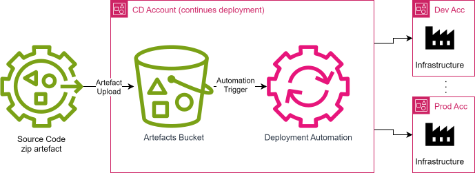

### README.md for Simple CD Solution

# Simple CD Solution

Simple CD is a Continuous Delivery (CD) solution built on AWS to automate the deployment and management of
infrastructure using Terraform. This solution leverages AWS services such as S3, Lambda, and CodeBuild to provide an
efficient and secure pipeline for infrastructure as code (IaC) delivery.

## Table of Contents

- [Overview](#overview)
- [Architecture](#architecture)
- [Prerequisites](#prerequisites)
- [Setup Guide](#setup-guide)
- [Usage](#usage)
- [Components](#components)
- [Testing](#testing)
- [Troubleshooting](#troubleshooting)
- [License](#license)

## Overview

The Simple CD solution automates the deployment process by triggering actions based on S3 events. When a Terraform
source code zip file is uploaded to an S3 bucket, a Lambda function processes the event and initiates an AWS CodeBuild
project to apply or destroy infrastructure, depending on the event type.

## Architecture



The architecture consists of the following components:

1. **S3 Bucket**: Stores the Terraform source code zip files.
2. **Lambda Function**: Analyzes S3 events and triggers the appropriate CodeBuild project.
3. **AWS CodeBuild**: Runs the Terraform commands to apply or destroy infrastructure.
4. **IAM Roles and Policies**: Provide the necessary permissions for Lambda and CodeBuild to interact with AWS
   resources.

## Prerequisites

Before you begin, ensure you have the following:

1. **AWS Account**: Access to an AWS account with the necessary permissions.
2. **AWS CLI**: Installed and configured with your AWS credentials.
3. **Terraform**: Installed on your local machine.
4. **Zip Utility**: For packaging Terraform source code.
5. **Text Editor/IDE**: For writing and editing Terraform configuration files.

## AWS Account Prerequisites 

1. Deployment account
   * Administrator role for deployment of the cd automation (the current solution)
   * S3 Bucket (at least one) - for containing the artefacts, lambda source and terraform states for the delivers.
   * Used prefixes in the different buckets (created automatically by the solution's infrastructure):
     * artefacts - the prefix which is monitored for new artefacts
     * terraform-states - the prefix that is used for storing the terraform states
     * lambda-src - the prefix used for storing the lambda code archive
   * If one bucket is provided, it will create the prefixes in the one bucket.
2. Target account
   * Deployment role, that trusts the deployment account to be assumed and has the needed permissions to deploy the example web server.
     You can use [template permissions files](web/cd/deployment-role/) for the needed permissions used for the example
     web server IaC

## Setup Guide

Follow these steps to set up the Simple CD solution:

### Step 1: Deploy the Simple CD infrastructure

1. Make sure that you have command line access to the Deployment account and enter `<repo-root>/terraform` folder
2. Use the provided template files [config.auto.tfvars.template](terraform%2Fconfig.auto.tfvars.template) and [config.s3.tfbackend.template](terraform%2Fconfig.s3.tfbackend.template)
   as the base for the infrastructure deployment. [More information](https://developer.hashicorp.com/terraform/language/settings/backends/configuration)
3. Execute the following commands
    ```bash
    terraform init -backend-config=config.s3.tfbackend
   # if created config.auto.tfvars the file will provide the needed variables for the deployment
    terraform plan
    # Review the plan output to ensure all resources are correctly defined.
    terraform apply
    # Confirm the apply action by typing `yes` when prompted.
    # Wait for Terraform to create the resources in your AWS account.
    ```
### Step 2: Prepare the example artefact

1. Enter the `<repo-root>/web/cd/configs` and copy the template in the same directory. The name of the enviroment is used
in the step above as variable in the Deployment automation infrastructure inside: [variables.tf:33](terraform/variables.tf)
   ```bash
   cd web/cd/config
   # If the variable has value `dev`, the config file should have the name `dev.json`
   cp env.json.template dev.json
   ```
   
2. Fill up the configuration (dev.json) for the example deployment in the file. 
3. Use the provided bash script to create the archive needed for the automation.
   ```bash
   cd <repo-root>/web
   bash create-web-artefact.sh
   ```
4. Once created, upload artefact to the artefacts bucket whit `artefacts` prefix
   ```bash
   cd <repo-root>/
   aws s3 cp web-artefact.zip s3://<target-bucket>/artefacts/
   ```

## Usage

### Creation of the example web app infrastructure

1. **Create a Zip File**:
    - Package your Terraform configuration files into a zip file.

2. **Upload to S3**:
    - Upload the zip file to the designated S3 bucket to trigger the apply process.

### Deleting of the example web app infrastructure

1. **Remove the Zip File**:
    - Delete the uploaded Terraform zip file from the S3 bucket to trigger the destroy process.

### S3 Bucket

- Stores Terraform source code zip files.
- Triggers events on object creation and deletion.

### Lambda Function

- Processes S3 events and determines the action (apply or destroy).
- Triggers the appropriate CodeBuild project.

### AWS CodeBuild

- Executes Terraform commands to apply or destroy infrastructure.
- Uses build specifications defined in `buildspec.yml`.

### IAM Roles and Policies

- Grant necessary permissions for Lambda and CodeBuild.
- Ensure secure cross-account resource management.

## Testing

1. **Upload a Test Zip File**:
    - Verify that the infrastructure is created as expected.

2. **Delete the Test Zip File**:
    - Verify that the infrastructure is destroyed as expected.

## Troubleshooting

- **Check CloudWatch Logs**: Monitor logs for Lambda and CodeBuild to debug issues.
- **Verify IAM Roles**: Ensure IAM roles have the correct permissions.
- **Review S3 Bucket Events**: Confirm that S3 events are correctly configured to trigger Lambda.

## License

This project is licensed under the MIT License. See the [LICENSE](LICENSE.md) file for details.

